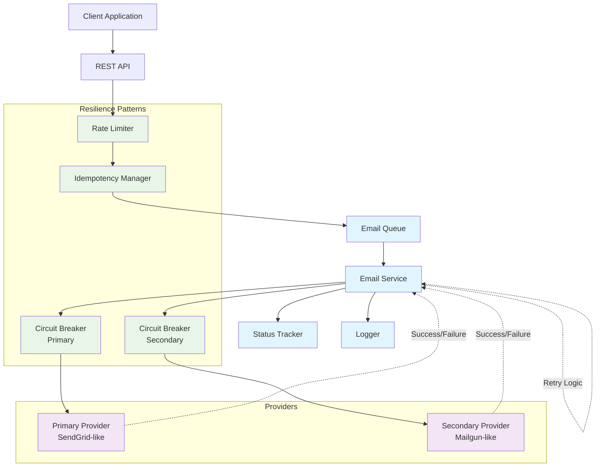
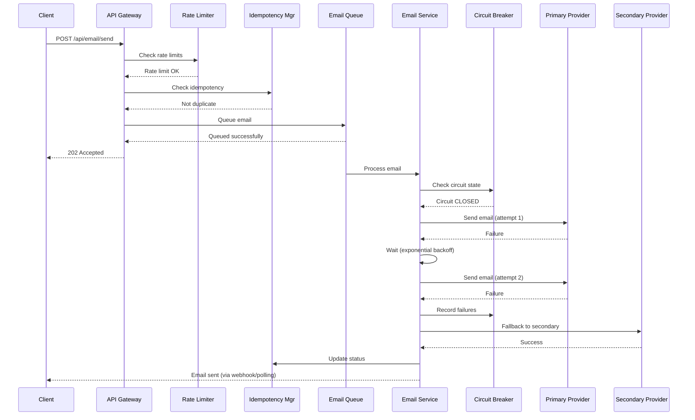
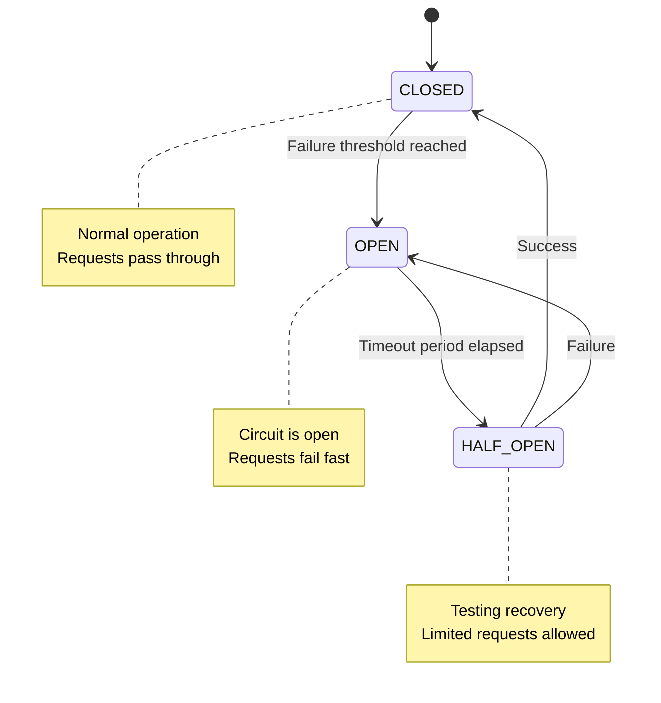
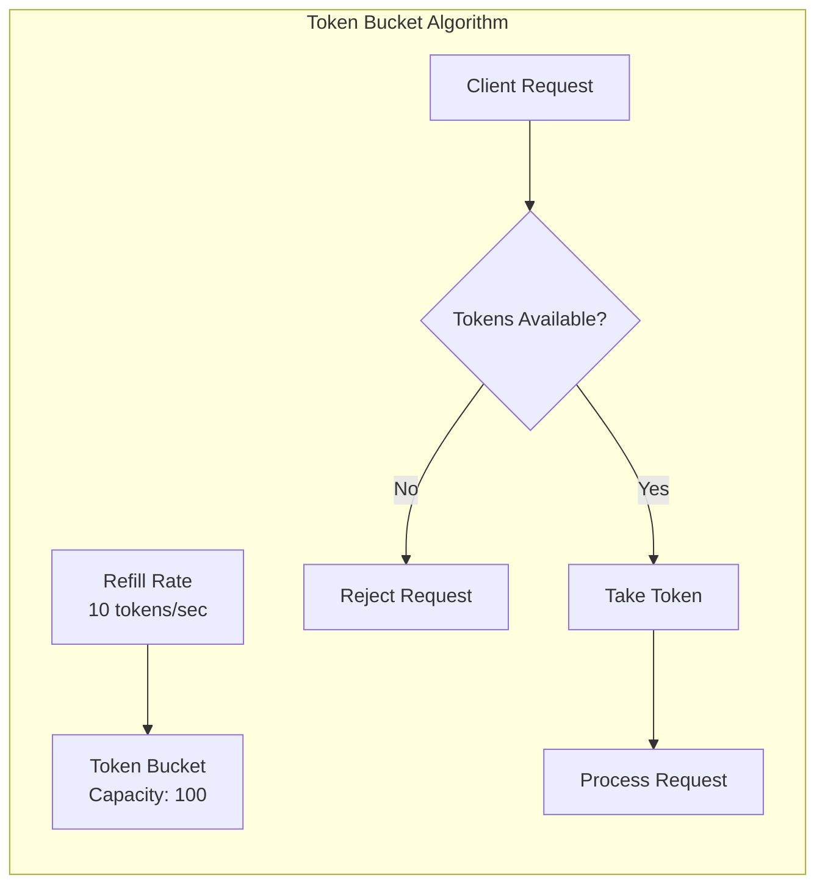

# Resilient Email Service

A production-ready email sending service built with Node.js that implements enterprise-grade reliability patterns including retry logic, fallback mechanisms, circuit breakers, and rate limiting to ensure robust email delivery.

## 🚀 Features

### Core Requirements
- **Retry Logic**: Exponential backoff with configurable attempts and jitter
- **Provider Fallback**: Automatic switching between email providers on failure
- **Idempotency**: Prevents duplicate sends using unique request identifiers
- **Rate Limiting**: Token bucket algorithm with configurable limits
- **Status Tracking**: Real-time monitoring of email delivery status

### Advanced Features (Bonus)
- **Circuit Breaker**: Prevents cascading failures with auto-recovery
- **Queue System**: Asynchronous email processing with concurrency control
- **Comprehensive Logging**: Structured logging for observability
- **Health Monitoring**: Service health endpoints with detailed metrics

## 🏗️ Architecture

The service implements a resilient architecture using two mock email providers that simulate real-world email services:



### Email Processing Flow



### Design Patterns
- **Strategy Pattern**: Pluggable email providers with unified interface
- **Circuit Breaker**: Fault tolerance and resilience with automatic recovery
- **Factory Pattern**: Provider instantiation and management
- **Observer Pattern**: Status tracking and event-driven logging
- **Queue Pattern**: Asynchronous processing with concurrency control
- **Retry Pattern**: Exponential backoff with jitter for resilience

## 📁 Project Structure

```
src/
├── providers/              # Email provider implementations
│   ├── BaseEmailProvider.js       # Abstract base class
│   ├── PrimaryEmailProvider.js    # Mock primary provider (SendGrid-like)
│   ├── SecondaryEmailProvider.js  # Mock secondary provider (Mailgun-like)
│   └── ProviderFactory.js         # Provider factory and management
├── services/               # Core business logic
│   ├── EmailService.js             # Main orchestration service
│   ├── RateLimiter.js             # Token bucket rate limiter
│   ├── CircuitBreaker.js          # Circuit breaker implementation
│   └── EmailQueue.js              # Async queue management
├── utils/                  # Utility modules
│   ├── Logger.js                  # Structured logging utility
│   └── IdempotencyManager.js      # Duplicate prevention
├── routes/                 # HTTP API routes
│   └── emailRoutes.js             # Email-related endpoints
├── middleware/             # Express middleware
│   └── validation.js              # Request validation and error handling
└── server.js               # Application entry point

tests/                      # Test suites
├── providers/              # Provider unit tests
├── services/               # Service unit tests
└── integration/            # API integration tests

frontend/                   # Visual testing dashboard (bonus)
└── src/                    # React.js dashboard for testing
```

## 🚦 Getting Started

### Prerequisites
- **Node.js**: Version 22.x or higher
- **npm**: Version 9.x or higher

### Installation

```bash
# Clone the repository
git clone <repository-url>
cd resilient-email-service

# Install dependencies
npm install
```

### Environment Configuration

Create a `.env` file in the root directory:

```bash
# Server Configuration
NODE_ENV=development
PORT=4000

# Provider Success Rates (for simulation)
PRIMARY_PROVIDER_SUCCESS_RATE=0.7
SECONDARY_PROVIDER_SUCCESS_RATE=0.9

# Retry Configuration
MAX_RETRY_ATTEMPTS=3
RETRY_BASE_DELAY=1000

# Rate Limiting
RATE_LIMIT_WINDOW=60000
RATE_LIMIT_MAX_REQUESTS=100

# Circuit Breaker
CIRCUIT_BREAKER_THRESHOLD=5
CIRCUIT_BREAKER_TIMEOUT=30000
CIRCUIT_BREAKER_RESET_TIMEOUT=60000

# Logging
LOG_LEVEL=info
```

### Running the Service

```bash
# Development mode (with auto-reload)
npm run dev

# Production mode
npm start

# Run tests
npm test

# Watch mode for tests
npm run test:watch
```

The service will be available at `http://localhost:4000`

### Visual Testing Dashboard (Optional)

A React.js dashboard is included for visual testing and monitoring:

```bash
cd frontend
npm install
npm start
```

Dashboard available at `http://localhost:3000`

## 📡 API Reference

### Send Email
Send a single email with retry and fallback capabilities.

```http
POST /api/email/send
Content-Type: application/json
X-Idempotency-Key: unique-request-id

{
  "to": "recipient@example.com",
  "subject": "Test Email", 
  "body": "Email content here"
}
```

**Response:**
```json
{
  "success": true,
  "messageId": "msg_abc123",
  "status": "sent",
  "provider": "primary",
  "attempts": 1,
  "timestamp": "2025-06-06T10:30:00Z",
  "idempotencyKey": "unique-request-id"
}
```

### Bulk Email Send
Send multiple emails efficiently.

```http
POST /api/email/bulk-send
Content-Type: application/json

{
  "emails": [
    {
      "to": "user1@example.com",
      "subject": "Bulk Email 1",
      "body": "Content 1",
      "idempotencyKey": "bulk-1"
    },
    {
      "to": "user2@example.com", 
      "subject": "Bulk Email 2",
      "body": "Content 2",
      "idempotencyKey": "bulk-2"
    }
  ]
}
```

### Check Email Status
Retrieve the status of a previously sent email.

```http
GET /api/email/status/{idempotencyKey}
```

### Service Health
Monitor service health and provider status.

```http
GET /health
```

**Response:**
```json
{
  "status": "healthy",
  "timestamp": "2025-06-06T10:30:00Z",
  "uptime": 3600,
  "providers": {
    "primary": { "healthy": true, "lastCheck": "2025-06-06T10:30:00Z" },
    "secondary": { "healthy": true, "lastCheck": "2025-06-06T10:30:00Z" }
  },
  "circuitBreakers": {
    "primary": { "state": "CLOSED", "failures": 0 },
    "secondary": { "state": "CLOSED", "failures": 0 }
  }
}
```

## 🔧 How It Works

### Email Sending Flow
1. **Request Validation**: Validate email format and required fields
2. **Rate Limiting**: Check if request is within rate limits
3. **Idempotency Check**: Verify if email was already sent
4. **Queue Processing**: Add email to processing queue
5. **Provider Selection**: Start with primary provider
6. **Retry Logic**: Implement exponential backoff on failures
7. **Fallback**: Switch to secondary provider after max retries
8. **Status Tracking**: Update status throughout the process

### Retry Strategy
- **Exponential Backoff**: Delays increase exponentially (1s, 2s, 4s, 8s...)
- **Jitter**: Random variance to prevent thundering herd
- **Maximum Attempts**: Configurable retry limit
- **Error Classification**: Different strategies for temporary vs permanent errors

### Circuit Breaker Pattern
- **Failure Threshold**: Opens circuit after consecutive failures
- **Timeout Period**: Time before attempting to close circuit
- **Half-Open State**: Gradual recovery testing
- **Automatic Recovery**: Self-healing capability



### Rate Limiting Algorithm
- **Token Bucket**: Allows burst traffic within limits
- **Configurable Window**: Time-based rate limiting
- **Per-Client Support**: Individual rate limiting (extensible)



## 🧪 Testing

The service includes comprehensive test coverage:

```bash
# Run all tests
npm test

# Run specific test suites
npm test -- --testPathPattern=providers
npm test -- --testPathPattern=services
npm test -- --testPathPattern=integration

# Coverage report
npm test -- --coverage
```

### Test Categories
- **Unit Tests**: Individual component testing
- **Integration Tests**: API endpoint testing
- **Provider Tests**: Mock provider behavior validation
- **Service Tests**: Business logic verification

## 🔒 Design Assumptions

1. **Idempotency Keys**: Clients must provide unique keys for duplicate prevention
2. **Email Validation**: Basic format validation (extensible for advanced validation)
3. **Memory Storage**: Development uses in-memory storage (Redis recommended for production)
4. **Mock Providers**: Simulate real email services with configurable failure rates
5. **Rate Limiting**: Global rate limiting (easily extended to per-client)
6. **Error Handling**: Graceful degradation with comprehensive error reporting

## 🚀 Production Considerations

### Storage
- Replace in-memory storage with **Redis** for caching and session management
- Use **PostgreSQL** or **MongoDB** for persistent email status tracking

### Message Queue
- Implement **Redis Bull** or **AWS SQS** for robust queue management
- Add dead letter queues for failed message handling

### Monitoring & Observability
- Integrate **Prometheus** metrics collection
- Add **structured logging** with ELK stack or similar
- Implement **distributed tracing** for request flow visibility

### Security
- Add **API authentication** (JWT/OAuth)
- Implement **input sanitization** and validation
- Add **HTTPS** termination with proper certificates

### Scalability
- **Horizontal scaling** with load balancers
- **Database connection pooling**
- **Caching layers** for improved performance

### Configuration Management
- Use **environment-specific** configurations
- Implement **secret management** (AWS Secrets Manager, HashiCorp Vault)
- Add **feature flags** for gradual rollouts

## 📄 License

MIT License - see LICENSE file for details

---

*This service was built as a demonstration of resilient system design patterns and enterprise-grade reliability features.*
